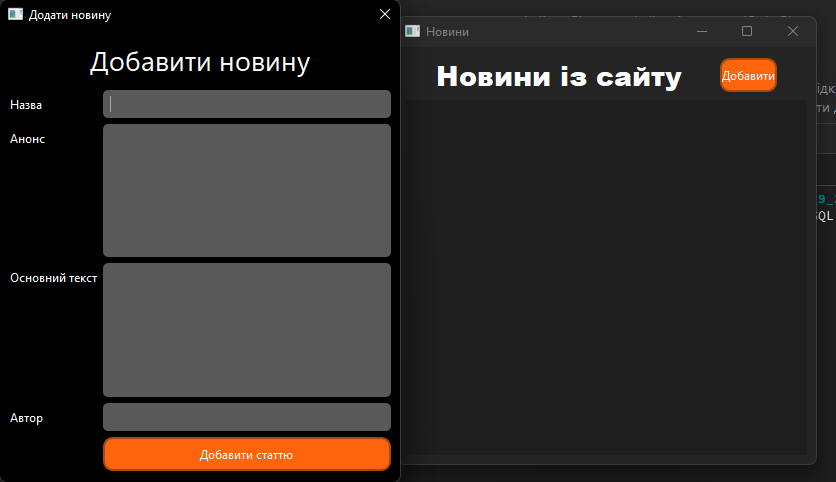

##  Система управління контентом «New_Blog»

Прикладний додаток для ведення особистого блогу, що дозволяє створювати публікації, зберігати їх у базі даних та переглядати у зручному інтерфейсі.

### Мета
Розробити легку систему управління контентом (CMS) для десктопних платформ, забезпечивши швидкий запис та структуроване відображення текстових постів.

###  Інструменти та технології
* **Мова:** C++
* **Framework:** Qt 
* **База даних:** SQL (MySQL)

### Опис задачі
Проєкт реалізовано як багатовіконний додаток:
1. **Вікно створення:** Форма для введення заголовка та тексту блогу з валідацією полів перед відправкою в БД.
2. **Вікно перегляду:** Динамічний список, який отримує дані з таблиці блогів та виводить їх у зручному для читання форматі.
3. **Database Integration:** Налаштування SQL-запитів для додавання (`INSERT`) та отримання (`SELECT`) записів.

###  Приклад SQL-запиту для збереження поста

INSERT INTO blogs (title, content, date_posted) 
VALUES ('Мій перший пост', 'Текст мого першого блогу про програмування...', NOW());
### Результати
Створено робочий прототип блог-платформи з можливістю тривалого зберігання даних.

Реалізовано зручну навігацію між вікнами створення та перегляду записів.

Забезпечено коректну роботу з кириличними шрифтами та кодуванням у базі даних.

### Візуалізація

№№№Інструкція з розгортання та запуску
Налаштування БД: Переконайтеся, що у вас встановлено локальний сервер MySQL або додано файл SQLite (залежно від обраної версії).

Відкриття проєкту: Запустіть файл конфігурації проєкту (.pro для Qt).

Збірка: Виконайте повну перезбірку (Rebuild), щоб середовище підготувало всі необхідні об'єктні файли.

Запуск: Після успішної компиляції запустіть програму. При першому запуску програма перевірить наявність таблиці blogs і, у разі її відсутності, створить її автоматично.

Автор: Михайло — Software & Database Developer
